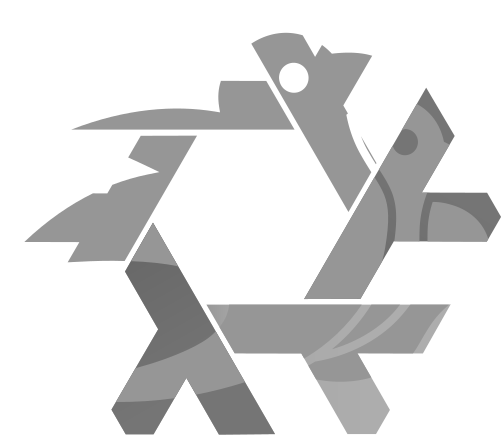

<div align="center">  </div>

# bevy-flake

A flake for development and distribution of [Bevy][bevy] programs.

This flake provides a pre-configured Nix environment for Bevy development, and
enables you to cross-compile release-ready portable binaries for platforms like
non-Nix Linux, MacOS[^1], Windows and WASM.
 
[^1]: For MacOS builds you need to set up the SDK. This takes no more than 5
      minutes. Read the MacOS docs for the guide on how to do this.

[bevy]: https://github.com/bevyengine/bevy

> [!NOTE]
> By compiling to the Windows MSVC targets, you are accepting the
> [Microsoft Software License Terms.][license]

[license]: https://go.microsoft.com/fwlink/?LinkId=2086102

## Setup

Navigate to your Bevy project root, then pull the template with the toolchain
from your favourite provider:

```sh
# The one using oxalica's rust-overlay:
nix flake init --template github:swagtop/bevy-flake#rust-overlay
```
```sh
# The one using nix-community's fenix:
nix flake init --template github:swagtop/bevy-flake#fenix
```
```sh
# The one from nixpkgs with no cross-compilation, but no extra inputs:
nix flake init --template github:swagtop/bevy-flake#nixpkgs
```

The packages this flake provides can also be imported and configured by
non-flake users. Read more about this [here.][non-flake-import]

[non-flake-import]: docs/config.md#non-flake-usage


## Usage

Add the packages you want from `bevy-flake` to your environment with
`nix develop`, with `nix shell`, or any other means.

Then, you can use them like so:

```sh
# With 'rust-toolchain', run and compile both for yours and other platforms:
# For your Nix system you can run:
cargo build
cargo run

# For other targets, just use '--target':
cargo build --target wasm32-unknown-unknown
cargo build --target x86_64-pc-windows-msvc
cargo build --target aarch64-apple-darwin # <-- Please read docs/macos.md.
```
```sh
# With `dioxus-cli`, develop Bevy with hot-patching:
BEVY_ASSET_ROOT="." dx serve --hot-patch --features bevy/hotpatching
```
```sh
# With `bevy-cli`, use the alpha CLI tooling:
# For your Nix system you can run:
bevy run

# Like cargo, build for other targets with '--target':
bevy build --target aarch64-pc-windows-msvc

# For web builds, you can also run and bundle them like so:
bevy run web --open
bevy build web --bundle
```

The packages come with a `develop` attribute, which are versions of the same
package, with only the dependencies needed for developing and compiling for the
host system included. It can be accessed with `<package>.develop`, and is the
default version of the packages included in the template flakes.

If you've set the `src` config attribute to the path of your project, you can
build it using Nix:

```sh
# Build all targets:
nix build .#targets --max-jobs 1 # Restricting builds to one target at a time.

# Build individual targets:
nix build .#targets.x86_64-unknown-linux-gnu

# Build individual targets, fetching only the dependencies for the specific one:
nix build .#targets.x86_64-unknown-linux-gnu.only

# Build your project from any machine with access to your repo:
nix build github:username/repository/branch#targets --max-jobs 1
```

You can compile to every target with a `targetEnvironments` [entry.][entries]
If the target you want isn't in the default configuration, you can add it
yourself by setting its environment up. More on that [here.][environments]

[entries]: config.nix#L155
[environments]: docs/config.md#targetenvironments

- [Configuration](docs/config.md)
- [Pitfalls](docs/pitfalls.md)
- [MacOS](docs/macos.md)
- [Windows](docs/windows.md)
- [Details](docs/details.md)
